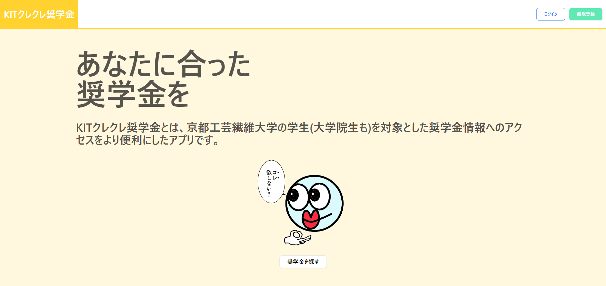
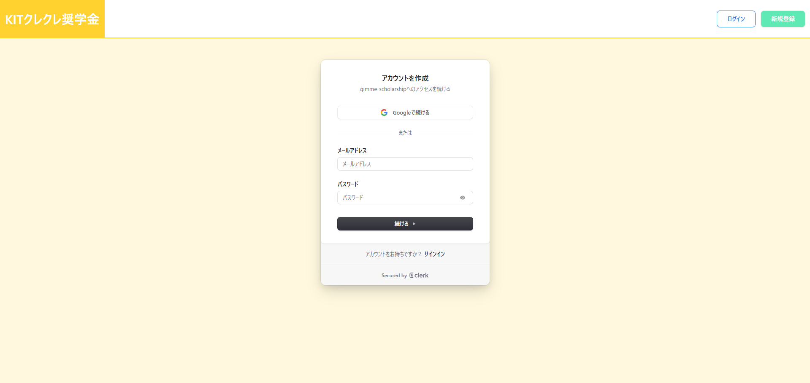
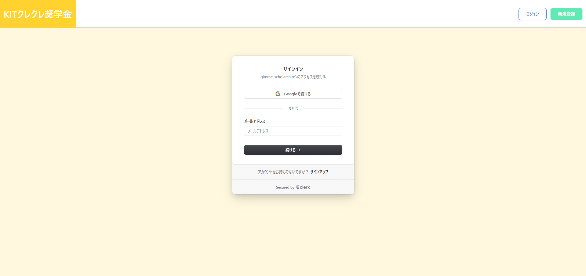
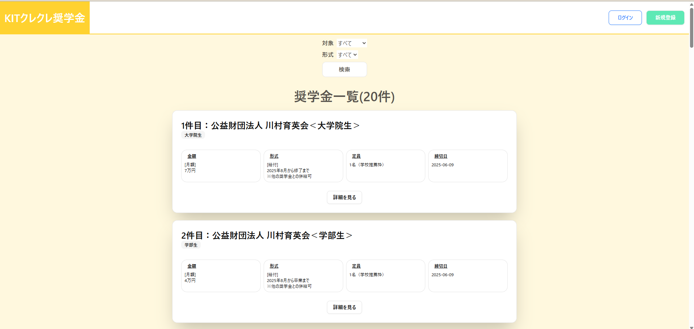
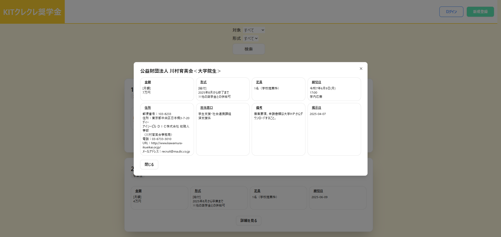

# このリポジトリについて

京都工芸繊維大学の学生を対象とした奨学金一覧へのアクセスを便利にした Web アプリ「KIT クレクレ奨学金」のフロントエンドのリポジトリです．

**バックエンド**: https://github.com/acu4git/gimme-scholarship/ 
**インフラ**: https://github.com/acu4git/gimme-scholarship-terraform/

# 開発環境

- Ubuntu 22.04.5(WSL2)
- Node.js 24.0.0
- npm 11.3.0
- Next.js 15.3.2
- React 19.0.0
- volta 2.0.1

# 認証

認証には Clerk を用いており，セッション管理などをライブラリに任せております．また，現時点(2025/06/03)では Google アカウント認証と一般的なパスワード認証を採用しています．パスワード管理の負担を減らすためであるのと，実装面での効率性を求めてこれらを用いています．

### 新規登録

### ログイン

# 奨学金一覧

検索機能は基本的なもの(対象・給付形式)に絞っており，これらだけで必要な情報を絞り込むことが出来ます．

### 一覧

### 詳細

# CI/CD

main ブランチ に push すると Amplify に自動的にデプロイを行います．

# スタイリング

コンポーネントライブラリの shadcn/ui と CSS フレームワークの tailwind-css を用いています．

# 実装予定

- [ ] お気に入り登録
- [ ] 奨学金のお気に入りランキング
- [ ] 奨学金の応募ボタンもつける(暇があれば)
